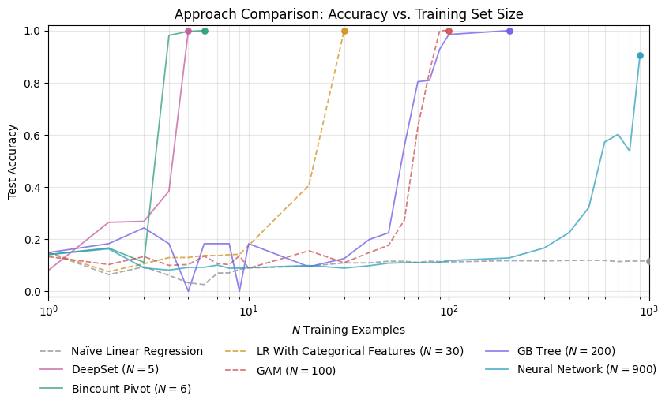

# Machine Learning Approaches to Petals Around the Rose

This is a collection of experiments for automated algorithms that can solve the
`Petals Around the Rose` game and correctly deduce the "rule" used to count the
number of "petals" on a roll of five dice. (If you're unfamiliar with the game,
I wrote an [interactive demo][DRP] that lets you experience it for yourself
without fear of spoilers.) These are didactic, intended to showcase weaker and
stronger methods, so any particular method might be intentionally sub-optimal.

The core implementation lives in `src/rose/`. It generates synthetic training
data, trains several approaches, and evaluates how quickly each model learns
the scoring rule. The approaches in this repo include linear baselines, a
bincount feature model, a GAM, a gradient-boosted tree, a fully connected
neural network, and a DeepSet model.


Most of the exploration happens in the notebooks under `notebooks/`. These
cover concept learning, exact methods, linear feature ideas, tree and neural
network experiments, hyperparameter tuning, and a DeepSet animation. Generated
comparison tables and plots are saved under `docs/approaches/`, with the HTML
summary template in `templates/summary.html`.



The key concept is [inductive bias][IB]. Models with an inductive bias that
matches the specific structure of the problem can learn quickly, sometimes from
just a handful of examples. Meanwhile, less specific, more general models with
a larger hypothesis space to explore need far more examples to convince themselves
that the patterns they're seeing are true:


## Setup

Install the project in editable mode with development dependencies:

```bash
pip install -e .[dev]
```

Then install the git hooks:

```bash
pre-commit install
```

Pre-commit runs a variety of Ruff linters and checks, as well as the pytest "smoke test," before allowing commits to complete.

## Tests

Run the test suite with:

```bash
pytest
```

## Notebooks

A brief exploratory data analysis to DQA and visualize the synthetic data:

- [eda.ipynb](notebooks/eda.ipynb): Explores how individual die values and small dice combinations relate to the target score.

The main entry point to formally loop over all approaches and produce a formatted report with visualizations and metrics:

- [summarize_approaches.ipynb](notebooks/summarize_approaches.ipynb)
- [sample summary report](https://htmlpreview.github.io/?https://github.com/olooney/rose-petals/blob/main/docs/approaches/summary.html)

Two of the models require hyperparameter optimization to provide confidence the models are well-suited to these data:

- [optuna_nn.ipynb](notebooks/optuna_nn.ipynb): Tunes a feed-forward neural network with Optuna and visualizes hyperparameter effects.
- [optuna_tree.ipynb](notebooks/optuna_tree.ipynb): Tunes a gradient-boosted tree with Optuna and inspects trial behavior and response surfaces.

A variety of other approaches, some with specialized visualizations:

- [concept_learning.ipynb](notebooks/concept_learning.ipynb): Enumerates a finite hypothesis space and filters rules consistent with observed examples.
- [deepset.ipynb](notebooks/deepset.ipynb): Prototypes a DeepSet architecture on one-hot dice inputs to study permutation-invariant learning.
- [deepset_animation.ipynb](notebooks/deepset_animation.ipynb): Trains a DeepSet-style model and generates animation frames for how its learned surface evolves.
- [exact_methods.ipynb](notebooks/exact_methods.ipynb): Solves the rule with exact and near-exact approaches including linear algebra and constraint solvers.
- [linear_counts.ipynb](notebooks/linear_counts.ipynb): Reframes rolls as face-count vectors and solves for the scoring coefficients with least squares.
- [linear_odd_feature.ipynb](notebooks/linear_odd_feature.ipynb): Tests simple hand-built oddness-based feature engineering for linear models.
- [tree.ipynb](notebooks/tree.ipynb): Experiments with a histogram gradient-boosted tree regressor on the petals prediction task.
- [other_approaches.ipynb](notebooks/other_approaches.ipynb): NN variants, GAM, symbolic regression

Just a helper notebook to check on GPU availablity for PyTorch.

- [gpu_device_check.ipynb](notebooks/gpu_device_check.ipynb): Checks PyTorch device availability and reports basic GPU or CPU execution details.


## Project Structure

```text
rose/
|-- docs/
|   `-- approaches/summary.html  # the HTML report produced by the summary notebook.
|   `-- images/                  # related images and saved plots
|-- notebooks/                   # visualizations and ad hoc models
|-- src/
|   `-- rose/                    # main source code
|       `-- templates/           # Jinja2 templates for reports (package-data)
`-- tests/                       # unit tests
```


[IB]: https://en.wikipedia.org/wiki/Inductive_bias
[DRP]: https://www.oranlooney.com/demos/rose-petals/
